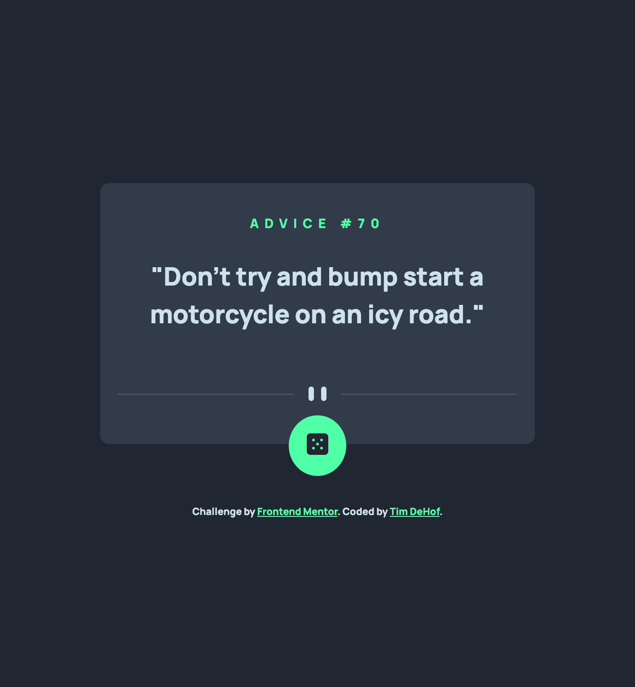

# Frontend Mentor - Advice generator app solution

This is a solution to the
[Advice generator app challenge on Frontend Mentor](https://www.frontendmentor.io/challenges/advice-generator-app-QdUG-13db).
Frontend Mentor challenges help you improve your coding skills by building
realistic projects.

## Table of contents

- [Overview](#overview)
  - [The challenge](#the-challenge)
  - [Screenshot](#screenshot)
  - [Links](#links)
- [My process](#my-process)
  - [Built with](#built-with)
  - [What I learned](#what-i-learned)
  - [Continued development](#continued-development)
  - [Useful resources](#useful-resources)
- [Author](#author)
- [Acknowledgments](#acknowledgments)

## Overview

### The challenge

Users should be able to:

- View the optimal layout for the app depending on their device's screen size
- See hover states for all interactive elements on the page
- Generate a new piece of advice by clicking the dice icon

### Screenshot



### Links

- Solution URL: [Add solution URL here](https://your-solution-url.com)
- Live Site URL:
  [https://timdehof.github.io/advice-generator/](https://timdehof.github.io/advice-generator/)

## My process

### Built with

- Semantic HTML5 markup
- CSS custom properties
- Flexbox
- CSS Grid
- Mobile-first workflow
- [React](https://reactjs.org/) - JS library
- [Vite](https://vitejs.dev/) - React framework
- [Styled Components](https://styled-components.com/) - For styles
- [typescript](https://www.typescriptlang.org/) - for typing

### What I learned

I used this challenge to practice some best practices with migrating code to
vite from create-react-app. Also I practice working with eslint code semantics.

```ts
/// <reference types="vite/client" />
```

Also, I practiced creating a theme guide based on style-guide markdown, which
worked and made it easier to style components. I will be doing that again on the
next challenge too. here is a sample of how made it:

```typescript
Breakpoint: {
    Mobile: "375px",
    Desktop: "1440px",
  },
```

### Continued development

I would like to continue practicing using typescript and vite for small
challenges. I would also like to try using other libraries and frameworks like
Next.js, Angular, and svelte.

In addition, I would like to create a boilerplate for this challenges so that I
can work on them alittle faster.

## Author

- Website - [Tim DeHof](https://www.timdehof.dev/)
- Frontend Mentor - [@timDeHof](https://www.frontendmentor.io/profile/timDeHof)
- Linkedin - [@timothy-dehof](https://www.linkedin.com/in/timothy-dehof/)
